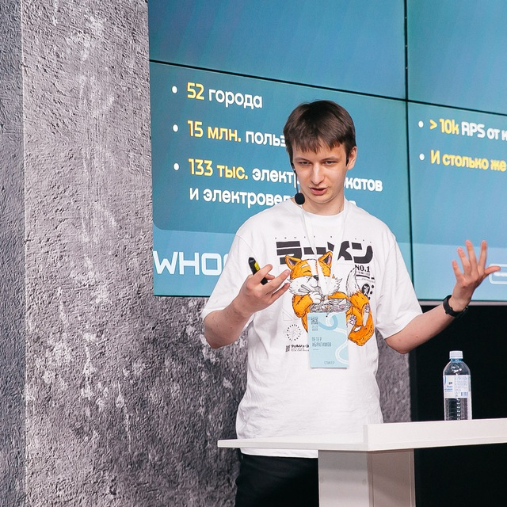

## Ибрагимов Петер Ильгизович

#### Middle backend GO developer
Связаться:
- Телеграм: [@teadove](https://t.me/teadove) (предпочтительно)
- Телефон: +79778725196
- Почта: peter.ibragimov@gmail.com

## Образование

#### 2024 НИТУ МИСиС
Бакалавриат Прикладная математика (01.03.04), Кафедра Инженерной кибернетики.
		
## ОПЫТ РАБОТЫ

### Whoosh
Сервис кикшеринга, whoosh-bike.ru, Москва.

Сентябрь 2021 - н.в.  

Бекенд разработчик

#### Обязаности
- Go + Python бекенд разработка с использованием
	- Go 1.21: gin, gorm, aws sdk
	- Python 3.10: sqlalchemy, fastapi, pydantic, boto3
- Активное использование инфраструктуры AWS: SQS, Kinesis, Cognito, AWS Lambda, DynamoDB, API Gateway.
- Оптимизация кода, профилирование и оптимизация SQL запросов для PostgreSQL, распил молонолитного Java сервиса на микросервисную архитектуру. Разработка высоконагруженных систем.
- Проектирование решение, разработка внутренних решений и корневых модулей-библиотек. 
- Деплоймент, настройка через IaC, использование terraform, terragrunt, grafana, aws cloudwatch metrics.
- Создание соглашений о написании кода, написание документации, code review, менторинг младших сотрудников, онбординг, проведение собеседований, приведение новых технологий и практик разработки в команду.

#### Достижения 
- Разработка с нуля бекенда сервиса лояльности, отвечающего за расчет лояльности пользователей и выдачи им привелегий.
- Разработка сервиса для оптимизации поиска самокатов через денормализацию, отдельный кластер СУБД и PostGIS.
- Оптимизация работы высоконагруженного эндпоинта за счет переписывания кода с python на go: потребление памяти уменьшилось в 2 раза, cpu time - 9 раз, время ответа - 10 раз.

## Сертификаты и достижения

### 2023
- [Доклад](https://www.youtube.com/watch?v=cSZrWpyNlfI) на конференции PyCon RU "Как использовать serverless и не наломать дров" 
- [Статья](https://habr.com/ru/companies/whoosh/articles/728926/) на habr о подходах в разработке на AWS Lambda

### 2021
- Победитель в “Хакатон Добра 2.0”
- Победитель (1 место) хакатона Whoosh Mobility Hack
- Победитель (1 место) хакатона CRMHACK, решение проблемы автоматизации оценки качества ведения диалога сотрудником коллцентра, автоматическое создание скриптов разговоров.

## НАВЫКИ		
- Языки программирования: 
	- Go 1.21 
	- Python 3.10
- Базы данных и иная инфраструктура: 
	- Postgresql
	- PostGIS
	- DynamoDB
	- Redis
	- Tile38
	- Kafka
	- SQS
- Фреймворки и библиотеки:
	- Go
		- Gin
		- Gorm
		- Zerolog
	- Python
		- Fastapi
		- SQLAlchemy
- Опыт работы с Git, Github, Gitlab, Trello, Notion.
- Работа с *nix-системами, bash скрипты, администрирование linux серверов
- Latex - вёрстка математических текстов.
- Математическое и логическое мышление. Самообучаемость, автономность, сосредоточенность на задаче.
- Языки: 
	- Английский язык: B2, IELTS 6.0
	- Русский язык: родной

### Ссылки
- [Github](https://github.com/TeaDove/)
- [Linkedin](https://www.linkedin.com/in/peter-ibragimov-7907871b7/)
- [Резюме](https://github.com/TeaDove/resume/)

